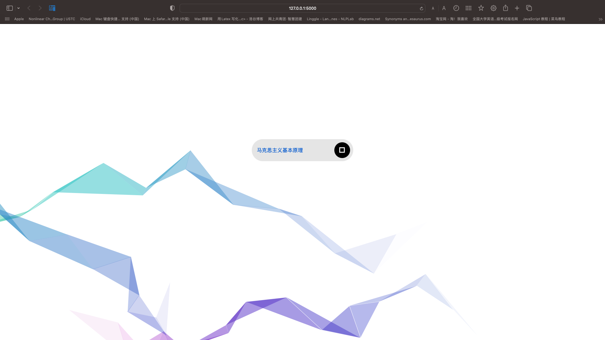

# USTC评课社区词云图生成器 V1.0.0

## 引言
&emsp;&emsp;计算机与网络的发展使得信息的制造与传播日趋频繁，对于刚步入大学生涯的科大学子而言，**关于课程的信息无疑是最重要的信息之一**。一门课的水平如何、给分怎么样、是否有速通宝典等等都是一名大学生在学期初最关心的事，因为此时对课程、老师的选择将会决定未来一学期的努力方向。在这个时候，每一位同学都会借助网络搜索这些关于课程的信息，以期按照培养方案以及自身需求，选出最适合的课程。

&emsp;&emsp;**USTC评课社区（icourse.club）** 就是这样一个同学们交流课程学习经验的平台。自2015年上线以来，评课社区累计已有逾 8000 名用户、逾 14000 门课程以及逾 20000 条点评。在这些课评中不乏干货、吐槽、提出对课程的建议以及课程设计的不合理之处。经过多年的积淀，评课社区已经成为科大学子学习生活不可或缺的一部分。自 2022 年以来，评课社区维护团队再次聚首，又推出了评论排序、匿名评论、站点统计等新功能，为同学们的选课与评课提供了很多帮助。

&emsp;&emsp;然而，随着课评数量的增长以及课评长度的提升，评课社区对于一门课程的搜索结果往往令人眼花缭乱；单纯以评分作为一门课程优劣的标准也有失偏颇。为了选出最适合自己的课程，选课同学需要阅读同一课程不同老师的班级风评如何，并且还希望在字里行间找出更多细节性的信息，这也无疑是最耗费时间的一个环节。**如何增加这些细节信息提取的效率，成为我们选课过程中最迫切需要解决的问题。** 

&emsp;&emsp;在此，我们选择使用词云图来可视化关于课程更多的细节，以期增加比较同一课程不同班级的效率。这样的尝试不仅有利于选课同学快速了解课程、老师的风评如何，它也作为除了评分、难度、收获等指标以外的又一评价标准，能够在筛选课程环节中为同学们节省很多的时间。

## 快速上手

### 网页呈现
打开 `main.py` 并运行，结果为本地网页。使用浏览器访问 `http://127.0.0.1:5000/`，将会出现如下界面：

在输入框中输入想要搜索的课程名称，点击搜索按钮：

浏览器将会打开两个页面，一个是评课社区对应界面，另一个将会跳转至结果呈现页面（需要等待较长时间） `http://127.0.0.1:5000/wordcloud` ：

词云图按照从左到右、从上到下的顺序与评课社区搜索结果的顺序一一对应。