# USTC评课社区词云图生成器 V1.0.0

## 引言
&emsp;&emsp;计算机与网络的发展使得信息的制造与传播日趋频繁，对于刚步入大学生涯的科大学子而言，**关于课程的信息无疑是最重要的信息之一**。一门课的水平如何、给分怎么样、是否有速通宝典等等都是一名大学生在学期初最关心的事，因为此时对课程、老师的选择将会决定未来一学期的努力方向。在这个时候，每一位同学都会借助网络搜索这些关于课程的信息，以期按照培养方案以及自身需求，选出最适合的课程。

&emsp;&emsp;**USTC评课社区（icourse.club）** 就是这样一个同学们交流课程学习经验的平台。自2015年上线以来，评课社区累计已有逾 8000 名用户、逾 14000 门课程以及逾 20000 条点评。在这些课评中不乏干货、吐槽、提出对课程的建议以及课程设计的不合理之处。经过多年的积淀，评课社区已经成为科大学子学习生活不可或缺的一部分。自 2022 年以来，评课社区维护团队再次聚首，又推出了评论排序、匿名评论、站点统计等新功能，为同学们的选课与评课提供了很多帮助。

&emsp;&emsp;然而，随着课评数量的增长以及课评长度的提升，评课社区对于一门课程的搜索结果往往令人眼花缭乱；单纯以评分作为一门课程优劣的标准也有失偏颇。为了选出最适合自己的课程，选课同学需要阅读同一课程不同老师的班级风评如何，并且还希望在字里行间找出更多细节性的信息，这也无疑是最耗费时间的一个环节。**如何增加这些细节信息提取的效率，成为我们选课过程中最迫切需要解决的问题。** 

&emsp;&emsp;**在此，我们选择使用词云图来可视化关于课程更多的细节，以期增加比较同一课程不同班级的效率。** 这样的尝试不仅有利于选课同学快速了解课程、老师的风评如何，它也作为除了评分、难度、收获等指标以外的又一评价标准，能够在筛选课程环节中为同学们节省很多的时间。

## 快速上手

打开 `main.py` 并运行，结果为本地网页。使用浏览器访问 `http://127.0.0.1:5000/`，将会出现如下界面：

在输入框中输入想要搜索的课程名称，点击搜索按钮：

浏览器将会打开两个页面，一个是评课社区对应界面，另一个将会跳转至结果呈现页面（需要等待较长时间） `http://127.0.0.1:5000/wordcloud` ：

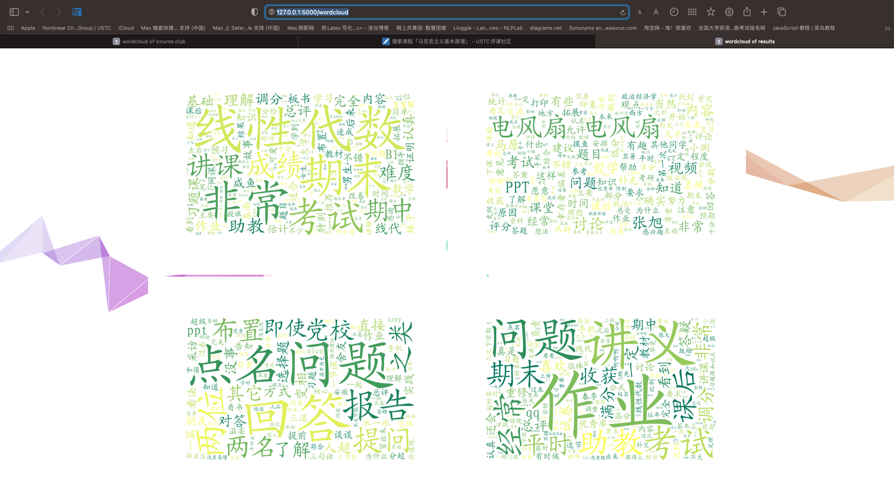

词云图按照从左到右、从上到下的顺序与评课社区搜索结果的顺序一一对应。如果浏览器响应超时，请查看 `static/wordcloud` 文件夹，按照从 0 到 9 的顺序依次对应评课社区的搜索结果。

## Python 程序介绍

### main.py

&emsp;&emsp;这是本程序的前端文件，集中呈现了本工作的主要成果。使用方法已经在 `快速上手` 中说明。

&emsp;&emsp;`main.py` 是一个以 `flask` 为基础的网页程序，其核心目的在于将词云生成结果以网页形式呈现出来，为此在 `templates` 文件夹下有能够实现这个功能的网页文件 `indexsearch.html` 和 `wordcloud.html`，分别对应搜索界面与结果呈现界面。

&emsp;&emsp;首先引入必要的包，其中 `package.web` 文件中有本程序的核心函数，将在后面介绍：

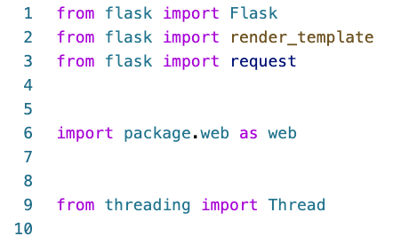

定义从线程中传值给主进程的 `CommentsThread` 类，这个类使得主进程可以从多线程的关键词提取中获得线程处理的结果：

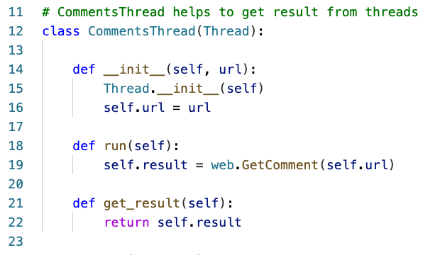

打开程序搜索界面 `indexsearch.html`：

用户点击提交后即使用 `JavaScript` 代码打开结果呈现界面 `wordcloud.html`，打开的同时使用 `AJAX` 获得用户提交的课程名称，开始网页解析、关键词提取以及词云图绘制：

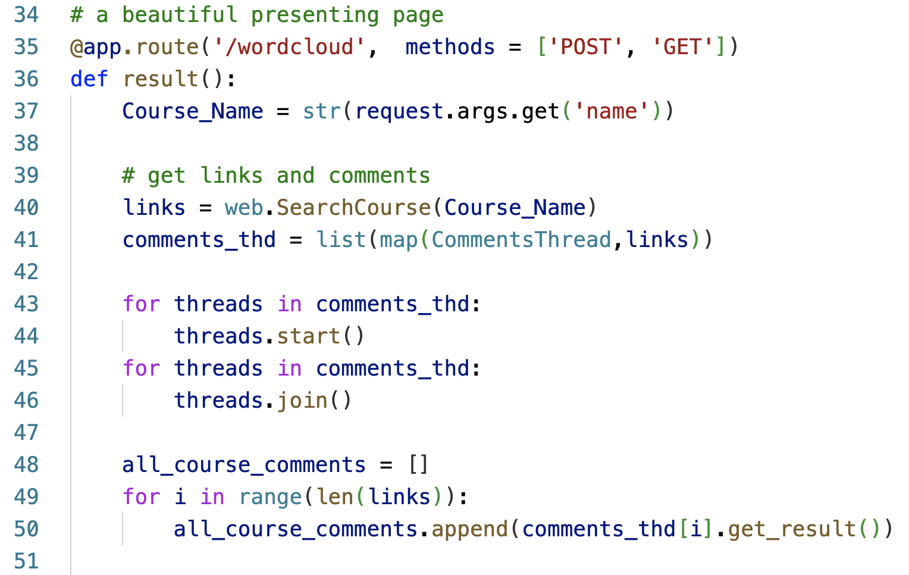

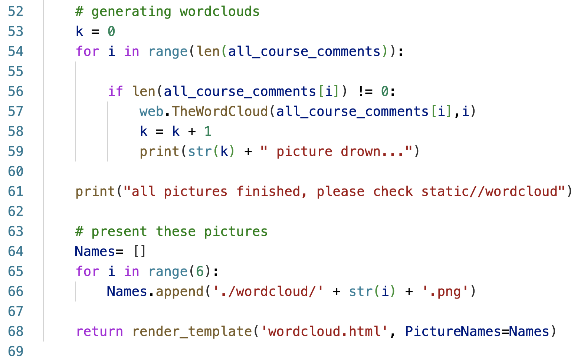

### web.py

&emsp;&emsp;这是本程序的辅助文件，其中包含四个主要函数，是本作业的核心。

&emsp;&emsp;通过键入课程名称，`SearchCourse` 返回由不同教师教授的同一课程的链接。这是学生每学期开始选课的第一步：

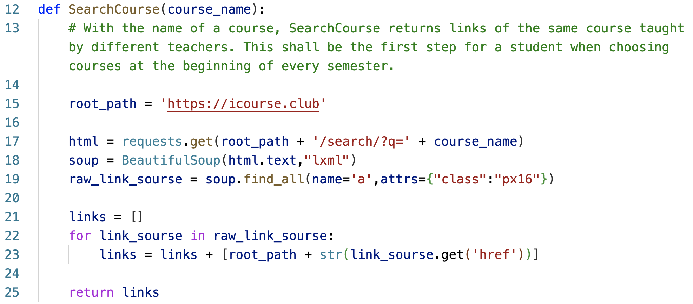

&emsp;&emsp;`GetComment` 是一个应用于评课社区单一网页的函数，它可以在单一课程下提取所有评论，仅需输入该课程的 `url`，并在一个列表中返回所有评论：

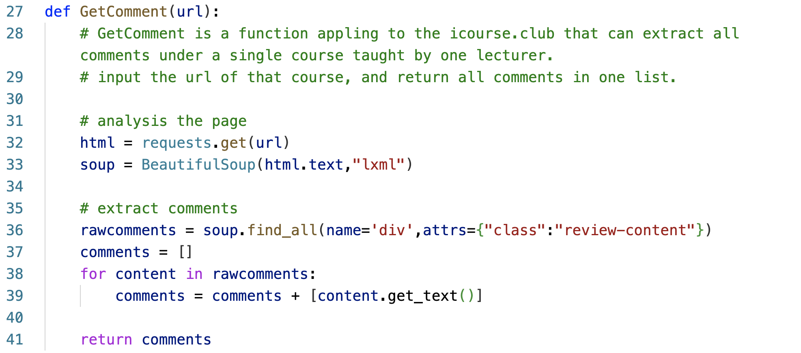

&emsp;&emsp;`CatchWords` 是一个将评论列表分解为关键字的函数。建议对 `GetComment` 所输出的结果使用：

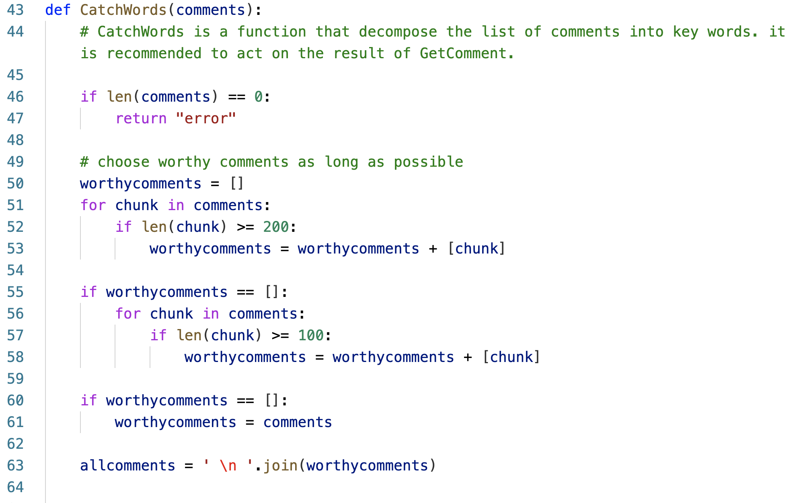

&emsp;&emsp;`TheWordCloud` 是一个综合函数，结合了上述所有功能，从而产生词云图，仅需输入列表形式的评课(基于GetComments)。另一个输入参数是 `FileNumber`，其用于按顺序命名生成的词云图：

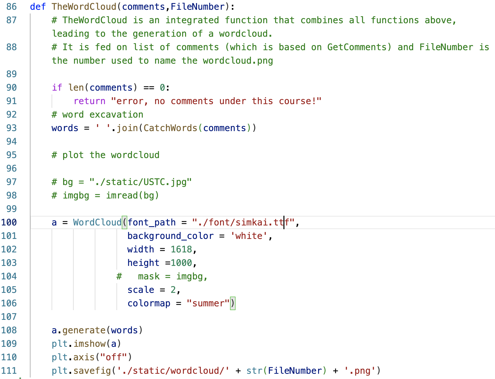

### CloudGenerate.py

&emsp;&emsp;`CloudGenerate.py` 是在 `main.py` 文件运行不了时的补救方案，它仅保留了词云生成的最基本、最核心功能。打开 `CloudGenerate.py`，找到 `Course_Name = ""` 并将用户希望搜索的课程名称以字符串的形式赋值给它：

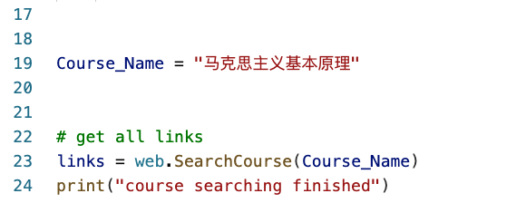

点击运行，即可在终端查看进度：

词云图保存在 `static/wordcloud` 文件夹中：

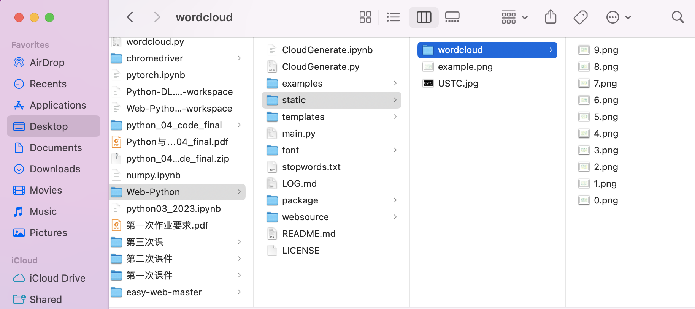

### CloudGenerate.ipynb

&emsp;&emsp;`CloudGenerate.py` 是在 `main.py` 文件运行不了时的补救方案，它也保留了词云生成的最基本、最核心功能，并在选择不保存的情况下支持并行绘制词云图，并在 `jupyter notebook` 中查看。

&emsp;&emsp;依次运行各计算单元即可。

## html 页面介绍

### indexsearch.html

&emsp;&emsp;这是搜索界面，***请一定要驻足欣赏这优雅的背景与搜索框展开动画！***

&emsp;&emsp;实现前后端数据交互的是 `Search` 函数，其使用 AJAX 实现：

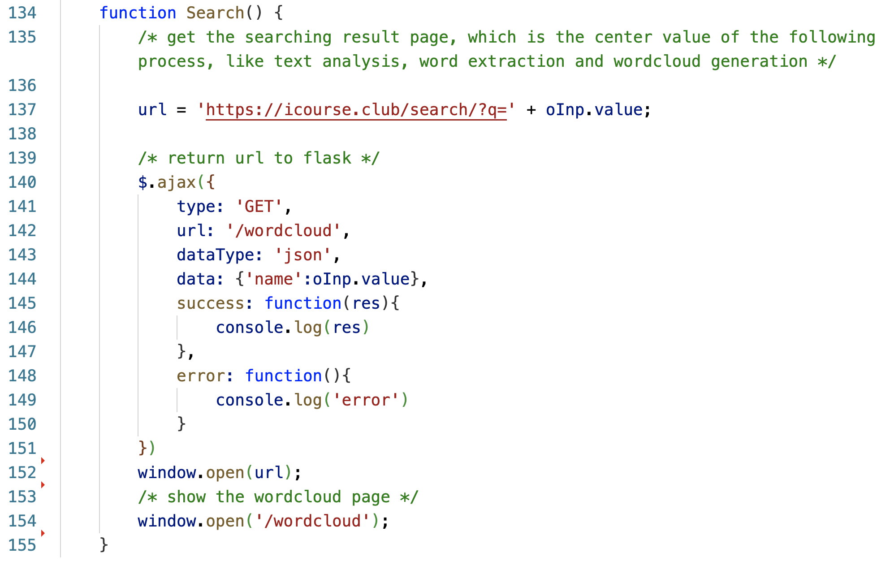

### wordcloud.html

&emsp;&emsp;这是词云图的结果呈现界面，目的是在后端绘制完成词云图后将图片以网页的形式呈现出来，核心部分如下：

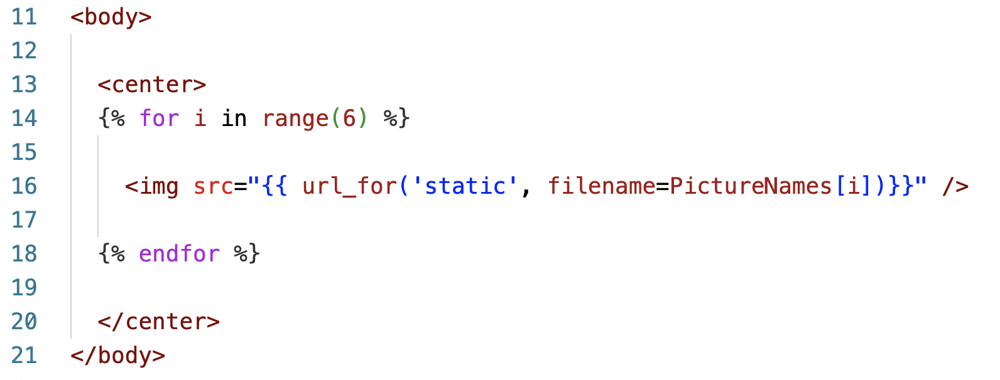

## 其他特性

### 评课长度分布图

&emsp;&emsp;`CloudGenerate.py` 还可以单独绘制某一门课的评课长度分布图，只需要给出课评网页：

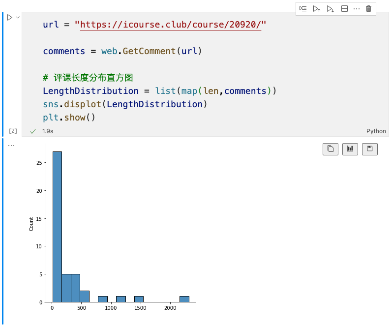

### 生成带有蒙版的词云图

取消 `web.py` 里 `TheWordCloud` 函数中蒙版引入部分的注释：

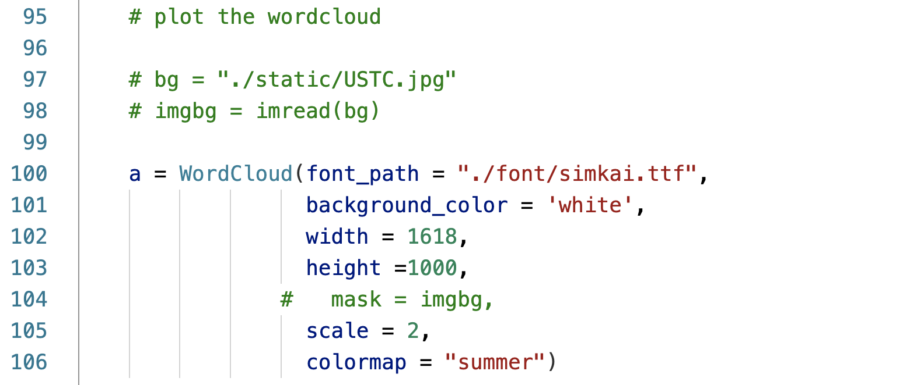

即可绘制含有蒙版的词云图：

## 总结
 
### 程序亮点

1. **全新的选课辅助工具（MAKE USTC GREAT AGAIN! ）**

2. **优雅的搜索界面（颜值就是一切！）**

2. **用户友好的使用方法（可以根据需求任意改动！）**

3. **关键词多线程提取，提升处理速度**

### 不足之处

2. 最主要的问题在于单线程绘制词云图需要等待较长时间，但多线程会导致内核崩溃和保存错位的问题。

1. `http://127.0.0.1:5000/wordcloud` 时常会响应超时，目前没有找到一个合适的解决方案。

3. `main.py` 只支持对评课社区搜索结果第一页的检索结果进行抓取，若有特定需要必须另外打开 `CloudGenerate.py` 或者 `CloudGenerate.ipynb` 文件进行自定义。